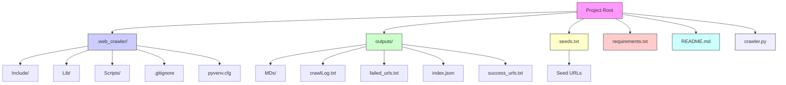
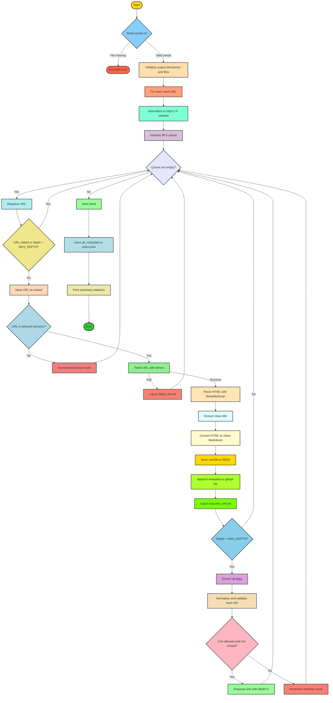

# 🕷️ Web Crawler & Content Archiver

A focused, ethical web crawler that extracts clean, readable content from specified domains and saves structured metadata in JSON format along with human-readable Markdown files.

---

## 📌 Introduction

This Python-based web crawler is designed to:
- Crawl websites **only within allowed domains** (e.g., `jeevee.com`, `kiec.edu.np`)
- Respect depth limits and avoid external/social media links
- Convert HTML pages into **clean, readable Markdown**
- Generate a **structured JSON index** with full metadata for every crawled page
- Log successes, failures, and activity for auditability

Ideal for **content archiving, documentation, research, or compliance** use cases where clean, structured data extraction from trusted domains is required.

---

## 🛠️ Tools and Technologies Used

| Component | Technology |
|---------|------------|
| **Language** | Python 3.8+ |
| **HTTP Client** | `requests` |
| **HTML Parsing** | `BeautifulSoup4` |
| **URL Handling** | `urllib.parse` |
| **Data Structure** | `collections.deque` (BFS queue) |
| **File I/O** | Built-in `pathlib`, `json`, `re` |
| **Logging** | `logging` module |
| **Output Format** | JSON (metadata), Markdown (content) |

---

## 🏗️ Project Architecture

The system follows a **breadth-first crawl** strategy with configurable depth, domain whitelisting, and content sanitization.


---

## 🔄 Program Execution Flowchart


---
## 🚀 Getting Started [Run Program File]

Follow the steps below to set up and run the project on your local machine.

---

### 1. Clone the Repository
```bash
git clone <REPOSITORY_URL>
cd <PROJECT_FOLDER>

```

### 2. Create a Virtual Environment
```bash
python -m venv .venv
```

### 3. Activate the Virtual Environment

Windows (PowerShell):
```bash
.venv\Scripts\Activate.ps1
```
Windows (CMD):
```bash
.venv\Scripts\activate.bat
```
Linux / macOS:
```bash
source .venv/bin/activate
```

### 4. Install Dependencies
```bash
pip install -r requirements.txt
```

### 5. Run the Crawler
```bash
python Crawler.py
```

## ⚙️ Configuration & Hyperparameters

You can control the crawler behavior by modifying variables inside **`Crawler.py`** (or through a separate config file if available).  
Below are the main parameters you can tune:

| Parameter         | Description                                                                 | Default Value |
|-------------------|-----------------------------------------------------------------------------|---------------|
| `MAX_DEPTH`       | Maximum depth to crawl (how many link levels from the seed).                | 3             |
| `REQUEST_TIMEOUT` | Timeout for each request in seconds.                                        | 10            |
| `POLITE_DELAY`    | Delay (in seconds) between requests to avoid overloading servers.           | 1             |
| `USER_AGENT`      | User-Agent string to use in requests.                                       | Custom crawler|
| `OUTPUT_DIR`      | Folder where results will be saved.                                         | `output/`     |
| `SEEDS_PATH`      | Path to the seeds file containing initial URLs.                             | `seeds.txt`   |

---

### 🔧 Setting up the Hyper Parameters

The crawler can be controlled by adjusting hyperparameters. These define how deep, fast, and broad the crawler runs.

---

1. Open **`Crawler.py`** (or `config.py` if exists).
2. Locate the **CONFIGURATION section** at the top of the file.
3. Change the parameter values as needed.  

Example:
```python
# ---- CONFIGURATION ----
MAX_DEPTH = 1         
REQUEST_TIMEOUT = 10  
RETRY_COUNT = 3        
POLITE_DELAY = 0.5    
```


4. Set your Allowed_Domain
    

5. Set your Blocked Domain
    
    
6. Set your Blocked Regex Parameter
   


### 🎯 Example Run with Modified Params
```bash
python Crawler.py --max_pages 50 --depth 2
```

## 📂 Output
All results generated by the crawler will be saved in the `output/` directory. 
Here are the samples of the output section
    
    
    
    


## 🙌 Conclusion

This project gives you a flexible and easy-to-use web crawler that you can tune to your own needs.  
By adjusting the hyperparameters, you can decide how deep, how fast, and how broad the crawler should go.  

Start small, experiment with the settings, and scale up as you get more comfortable.  
With just a few tweaks, you’ll have a crawler that works perfectly for your use case. 🚀  


